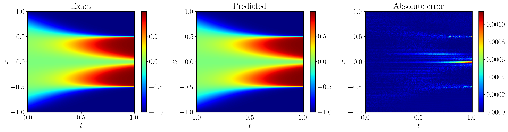

# Allen-Cahn equation

## Problem Setup

The partial differential equation is defined as 

$$\begin{aligned}
    & u_t - 0.0001 u_{xx} + 5 u^3 - 5 u  = 0,\quad t \in [0, 1],\ x\in[-1, 1],\\
    &u(x,0) = x^2 \cos(\pi x),\\
    &u(t, -1) = u(t, 1),\\
    &u_x(t, -1) = u_x(t, 1).
\end{aligned}$$

## Results

### Ablation study
We conducted an ablation study on **Algorithm 1**, maintaining identical hyperparameters across all tests. The results are displayed in the table below. You can find the specific configuration of the hyperparameters in the `configs` directory. 
For detailed sweep information, please visit [our Weight & Bias dashboard](https://wandb.ai/jaxpi/allen_cahn?workspace=user-).


| **Ablation Settings** |     |     |     |      **Performance**      |     |
| :---: | :---: | :---: | :---: |:-------------------------:| :---: |
| Fourier Feature | RWF | Grad Norm | Causal |     Rel. $L^2$ Error      | Runtime (min) |
| ✔ | ✔ | ✔ | ✔ | **$5.84 \times 10^{-4}$** | 16.26 |
| ❌ | ✔ | ✔ | ✔ |   $4.35 \times 10^{-1}$   | 13.20 |
| ✔ | ❌ | ✔ | ✔ |   $6.62 \times 10^{-3}$   | 16.53 |
| ✔ | ✔ | ❌ | ✔ |   $7.51 \times 10^{-3}$   | 16.36 |
| ✔ | ✔ | ✔ | ❌ |   $1.59 \times 10^{-3}$   | 16.11 |
| ❌ | ❌ | ❌ | ❌ |   $5.17 \times 10^{-1}$   | 12.93 |


### State of the Art

We present our state-of-the-art results. These are achieved by conducting a comprehensive hyperparameter sweep to find the optimal combination of network architecture, loss weighting scheme, and optimizer configuration. 

To replicate these results, use the following command:

```
python3 main.py --config=configs/sota.py
```

After training, use the following command to get the final predicted error and visualization.

```
python3 main.py --config=configs/sota.py --config.mode=eval
```


Our methods have managed to reduce the best relative $L^2$ error to
$9.55 \times 10^{-5}$. The figure below illustrates the exact solution, our model's prediction, and the absolute error. 

You can access the trained model parameters via [this Google Drive link](https://drive.google.com/drive/folders/1MJihlw87l9YiVVLA8JBtCubf8PB6hPZY?usp=drive_link).

For a comprehensive log of the loss and weights, please visit [our Weights & Biases dashboard](https://wandb.ai/jaxpi/allen_cahn?workspace=user-).

<figure>

</figure>

