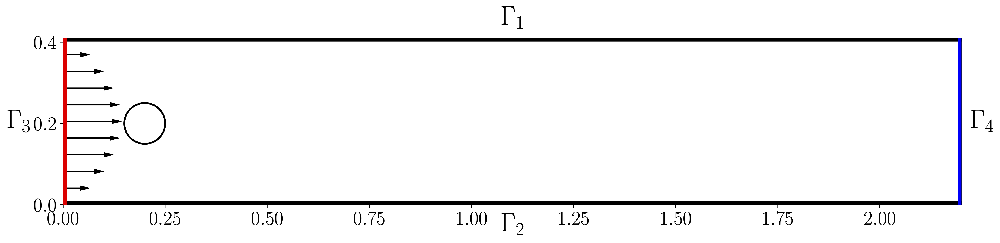

# Stokes flow

## Problem Setup

The partial differential equation is defined as 

$$\begin{aligned}
    -\nu \Delta \mathbf{u} +\nabla p=0, \\
    \nabla \cdot \mathbf{u} = 0,
\end{aligned}$$

where $\mathbf{u} = (u, v)$ defines the velocity and $p$ the pressure, and $\nu$ is the kinematic viscosity.



As depicted in the figure abov, the underlying geometry is a pipe without a circular cylinder $\Omega=[0,2.2] \times[0,0.41] \backslash B_r(0.2,0.2)$ with radius $r=0.05$.  For the top and bottom walls  $\Gamma_{1}=[0,2.2] \times 0.41$ and $\Gamma_{2}=[0,2.2] \times 0$ as well as the boundary $S=\partial B_r(0.2,0.2)$, we impose the no-slip boundary conditions,

$$\begin{aligned}
    u_{\mid \Gamma_{1}}=u_{\mid \Gamma_{2}}=u_{\mid S}=0 .
\end{aligned}$$

On the inlet $\Gamma_3=0 \times[0,0.41]$, a parabolic inflow profile is prescribed,

$$\begin{aligned}
    \mathbf{u}(0, y)= \mathbf{u}_{\mathrm{in}} = \left(\frac{4 U y(0.41-y)}{0.41^2}, 0\right)
\end{aligned}$$

with a maximum velocity $U=0.3$. On the outlet $\Gamma_4=2.2 \times[0,0.41]$, we define the outflow condition

$$\begin{aligned}
    \nu \partial_\mathbf{n} \mathbf{u}-p \mathbf{n}=0,
\end{aligned}$$

where $\mathbf{n}$ denotes the outer normal vector.


## Results

### Ablation study
We perform an ablation study on **Algorithm 1**. Table below shows the result of the ablation study. The detail training information can be found at [weight and bias link](https://wandb.ai/jaxpi/stokes?workspace=user-)


| **Fourier Feature** | **RWF** | **Grad Norm** | **Nondimensionalization** | **Rel. $L^2$ error** | **Run time (min)** |
|:------:|:---------------------:|:------:|:------:|:---------------------:|:------:|
| ✔️ | ✔️ | ✔️ | ✔️ | $5.41 \times 10^{-4}$ | 9.51 |
| ❌ | ✔️ | ✔️ | ✔️ | $9.56 \times 10^{-1}$ | 7.93 |
| ✔️ | ❌ | ✔️ | ✔️ | $9.86 \times 10^{-1}$ | 9.58 |
| ✔️ | ✔️ | ❌ | ✔️ | $1.01 \times 10^{-2}$ | 8.63 |
| ✔️ | ✔️ | ✔️ | ❌ | $9.74 \times 10^{-1}$ | 9.58 |
| ❌ | ❌ | ❌ | ❌ | $9.21 \times 10^{-1}$ | 7.95 |


### State of the art

We present our state-of-the-art results. 

To reproduce these results, use the following command:

```
python3 main.py --config=configs/sota.py
```

Once trained, to obtain the final predicted error and visualizations, run:

```
python3 main.py --config=configs/sota.py --config.mode=eval
```


The best relative $L^2$ error is brought down to $8.04\times 10^{-5}$. The figure below shows the exact solution, prediction, and absolute error. 
The model parameter can be found at [google drive link](https://drive.google.com/drive/folders/11T5ht2LGmIZigIKiLvpyUMbSxlrxb1sF?usp=drive_link).
For a comprehensive log of the loss and weights, please visit [our Weights & Biases dashboard](https://wandb.ai/jaxpi/stokes?workspace=user-).

<figure>

</figure>